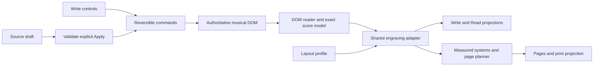

**Music Notes authoring: proposal for review**

Prepared August 27, 2026; approved for implementation the same day. Milestones 1–3 are the target; musical extensions in milestone 4 remain separately scoped. The accompanying review concept uses a static capture; the implemented workspace uses the shared vector renderer and real reflow.

The implemented controls and current limits are documented in the [Author workspace guide](author-workspace.md); verification is recorded in the [design review](design-review.md). Native PDF/font and physical printer qualification remains outstanding even though page composition and the print-request safeguards are tested.

**Build a separate authoring workspace beside the notation workbook.** Keep the workbook as the place to demonstrate and test the notation language. Add an independent `author.html` entry, with its own application state, stylesheet, and entry module. Both experiences should use the same custom elements, DOM reader, exact musical model, validation, and VexFlow adapter. The workbook must not load the editor bundle or become editable. A small navigation link between the two is sufficient; “Open a copy in Author” can follow later without changing the original study.

The proposed experience has three views of one document: **Write**, **Read**, and **Pages**. Write helps a composer express an idea; Read protects a performer's place; Pages prepares a specific score or part for paper. Start with desktop and keyboard authoring, support touch and narrow layouts, and avoid accounts or a backend in the first release. Printing and editable project export belong in that release, not in an indefinite future phase.

**The five specialist reviews changed the proposal in concrete ways.** These are agent perspectives, not human participants. The Golden Krishna perspective is an application of his published ideas, not impersonation or endorsement.

| Perspective | Recommendation adopted | Boundary to preserve |
| --- | --- | --- |
| Music engraver | Automatic spacing first; expose line, page, and keep controls at measure boundaries. Let hierarchy and proportion give the page character. | No equal-width bars by default, coordinate nudging, or shrinking dense music until it fits. |
| Modern jazz composer | Let each passage prescribe pitches, rhythm only, or open improvisation; make instructions easy to write. | Text such as “until cue” does not create executable navigation or known elapsed time. |
| Performer | Stable reading, independent part layouts, and review of both sides of an intended page turn. | A resting voice is not necessarily a resting performer; a piano part has two staves. |
| Design lead | Score dominates; selection reveals a small inspector; keep ordinary actions visible. | No permanent collection of symbol palettes, two sidebars, and source code competing for space. |
| Golden Krishna lens | Remove saving and layout chores; remember explicit preferences while keeping the next action discoverable. | Minimalism must not hide musical decisions behind commands people have to guess. |

Krishna's published principles concern supporting existing processes, assigning administrative work to computers, and adapting to individuals. Our application is to automate the work surrounding composition while keeping musical intent visible. [The Best Interface is No Interface](https://www.nointerface.com/). His discussion of discoverability also supports keeping visible controls alongside shortcuts. [Krishna's interview with Intercom](https://www.intercom.com/blog/podcasts/google-golden-krishna-screenless-experiences/).

**At the time of planning, the app provided the musical foundation, not the authoring application.** This baseline distinguished existing capabilities from the approved work.

| Present at the planning baseline | Authoring work planned |
| --- | --- |
| Explicit pitch spelling; notes, chords, rests, ties; additive meters; mixed and nested tuplets; aligned voices and staves. | Insertion, selection, range operations, reversible commands, and accessible editing controls. |
| Harmony, rehearsal marks, directions, dynamics, tempo, open slashes, and rhythmic slashes. | Contextual forms, musical-position entry, and safe conversion between passage types. |
| Source IDs, source lookup, event hit regions, diagnostics, render completion events, and a text transcript. | Persistent editing identities; complete measure, annotation, tuplet, and insertion geometry; structured keyboard navigation. |
| Responsive systems, explicit line/page breaks, keep preferences, and a separate fixed-width print projection. | Physical paper composition, independent part layouts, stable reading sessions, and turn-review records. |
| Validated JSON and canonical musical HTML serialization; bundled music fonts. | Full project saving, recovery of unfinished work, safe import, and a tested PDF/print workflow. |

These boundaries come from the [authoring guide](/Users/westbrook/Documents/repos/music-notes/docs/authoring.md), [surface API](/Users/westbrook/Documents/repos/music-notes/src/components/music-surface.ts), [score types](/Users/westbrook/Documents/repos/music-notes/src/model/types.ts), and [design review](/Users/westbrook/Documents/repos/music-notes/docs/design-review.md). The live workbook currently opens the browser print dialog; it does not generate a PDF file itself.

**Write should feel like working on the music, with a small set of tools within reach.** Keep the existing warm paper, dark notation, serif document titles, system-font controls, muted green actions, and restrained terracotta accents. Editing highlights and warnings must remain distinct from the musical ink and disappear from final output. Beauty should come from spacing, typography, clear instructions, and continuity, not decorative music symbols.

| Area | Default contents | Revealed when needed |
| --- | --- | --- |
| Document bar | Title, local save status, Undo/Redo, Write / Read / Pages, document menu. | Open, download project, export notation, document metadata. |
| Entry strip | Event type, duration, dots, explicit Insert action; current staff/voice/measure/beat. During pitched entry, the full spelling and octave remain visible, such as F-natural 4. | Tuplets, additional voices, and supported engraving options. Pitch controls remain available during note selection and insertion. |
| Main surface | Vertically stacked, automatically wrapped systems. | Selection, insertion caret, range handles, and draft markers. |
| Context inspector | Closed until an object or operation needs it. | Only the controls relevant to the selection; Source is a separate optional drawer. |
| Navigation | Compact Parts / Rehearsals control. | An outline generated from staff groups and rehearsal marks. |

Do not require a setup wizard. A new single-staff template can begin with one explicit full-measure rest and visible treble/C/4/4 defaults. “Write here” intentionally replaces that starter rest; it is not an automatic rule for filling unfinished music. Piano and ensemble templates add appropriately grouped staves with actual rest bars. Title, meter, and instrumentation remain editable where they appear.

On narrow screens, collapse the outline and use a dismissible inspector sheet that leaves the selection visible. Preserve readable music size; an oversized measure may need horizontal scrolling. Do not make a whole score an endless horizontal ribbon. On small phones, prioritize reading and focused edits; complex range work should remain available through a structured event list, not depend on precise tapping.

**The essential authoring loop is select, act, and continue.** A user should be able to complete it without opening Source.

1. Select a note, rest, measure, or musical position. A breadcrumb identifies staff, voice, measure, and beat. Clicking existing ink selects it; entering insertion is an explicit action with a visible caret.
2. Choose duration and enter pitches successively. Keep the remembered duration and octave visible. Letter entry uses explicit spelling: F means F natural, including in G major. Key-signature changes do not silently transpose notes.
3. Show exact remaining time in musical terms. A partially written bar can become an explicit `incomplete` draft, with an editing label. “Fill remainder with rests” is an intentional, undoable command: preview the rests within the selected measure or tuplet scope, preserve existing notes and wrappers, and decline when exact completion cannot be expressed with supported values without restructuring. It is not automatic rhythm rewriting. Reject overflow before committing a normal visual edit; offer an explicit next-measure action rather than silently splitting or rewriting rhythm.
4. Duplicate, move, or vary a passage using range commands. One action is one undo step, including associated IDs, draft flags, and selection changes. Copying creates new IDs. Structural changes across an ensemble preserve aligned measure counts and musical context.
5. Select the object to expose advanced controls: meter plus beat groups; chord pitches; voice; tuplet ratio and bracket; tie; annotation text and position; or beam/stem/accidental policy. Display written duration separately from elapsed tuplet time. A 3:2 group can contain a quarter plus an eighth; it is not necessarily three child events.
6. Keep selection and the visible musical location through re-engraving. Escape exits insertion or closes the contextual tool. Shortcuts operate only while the editor has focus and never intercept typing in text fields. Every shortcut has a visible equivalent.

Empty voices are currently invalid even when a measure is `incomplete`. An empty edit must remain an explicitly staged editor placeholder, or be intentionally replaced with a real rest; do not weaken validation to make an empty bar appear performable. Pending source or structural drafts must be recoverable separately from the accepted score. A last-valid engraving may remain visible only with an unmistakable “Preview has unapplied changes” state, and cannot be exported as if it contains those changes.

**Improvisation is a degree of specification within a passage.** Do not create a separate “jazz mode.”

| Composer's choice | Existing DOM expression | What the performer is being asked to do |
| --- | --- | --- |
| Written notes | `music-note`, `music-chord` | Play specified pitches and rhythm. |
| Written rhythm | `music-slash rhythmic` | Follow the written rhythm without prescribed pitches. |
| Open rhythm | `music-slash` | Improvise rhythm; slash durations provide positions, not required attacks. |
| Harmonic intent | `music-harmony` | Interpret chord-symbol text; no automatic voicing or transposition. |
| Performance instruction | `music-direction`, `music-rehearsal` | Follow printed words and labels; the app does not infer a playback route. |

Use a short original chart as the main product test: an eight-bar head, a two-bar open vamp, a rhythmic ensemble cue, and a written out. Add chord symbols at beats without reopening a dialog each time. Offer an optional instruction helper for material, interaction, and exit, producing ordinary editable prose such as “Use fragments of A; answer the drummer; on bass cue, finish this bar, then C.” It must not become an opaque preset object.

Converting written notes to slashes must preview the pitches or attack information that would be removed, require an explicit replacement action, and remain undoable. Keep “Chord symbol” separate from “Notes in chord.” New annotations should default to a named musical beat and write an explicit `at` value; preserve imported sequential annotation behavior and show that anchoring policy. “Follow this note” is a distinct future feature, not an accidental result of DOM reordering.

For example, this open bar uses the current grammar without a new authoring language:

```html
<music-staff id="lead" clef="treble">
  <music-measure id="vamp-1" meter="4/4" repeat-start end-bar="repeat-end">
    <music-rehearsal text="B"></music-rehearsal>
    <music-direction text="Vamp; exit on bass cue"></music-direction>
    <music-harmony text="Dm9" at="0"></music-harmony>
    <music-harmony text="G13(b9)" at="1/2"></music-harmony>
    <music-slash duration="quarter"></music-slash>
    <music-slash duration="quarter"></music-slash>
    <music-slash duration="quarter"></music-slash>
    <music-slash duration="quarter"></music-slash>
  </music-measure>
</music-staff>
```

The repeat barlines and exit instruction are printed intent. They do not make the number of repetitions, cue timing, or performed duration computable.

Since this plan was drafted, [quarter-tone notation and rhythm staves](notation-expansion.md), [3 roads music](three-roads.md), and [articulations, ornaments, and relative interval harmonies](event-markings.md) have been implemented. General slurs, transposition, independent polymeter, arbitrary microtonal tuning, cross-staff beams, cross-bar tuplets, free-time regions, and arbitrary graphical notation remain unsupported. Structured section/cue targets and improvisation spans with continuation marks are possible subsequent work. Each must extend model, grammar, validation, serialization, text accessibility, and engraving together. A text direction must never masquerade as implementation of these features.

**Read should preserve the performer's place.** Hide editing tools, select the score or a defined part, retain legible measure/rehearsal navigation, and move by explicit keyboard or touch actions. Do not add automatic scrolling, playback-following, or cue detection initially. Capture a stable layout on entry; opening unrelated controls must not rewrap it. On an actual viewport or orientation change, offer an intentional refit anchored to the current measure. Returning to Write restores that musical location.

A part is a group of staves for one performer, not necessarily one staff. Define this grouping explicitly before promising piano parts or turn review. Score and part views share one musical source but may have different layout preferences. Initial part output stays at authored pitch and must be labeled accordingly; it is not a transposing-part system.

Instruction ownership is also required: existing annotations belong to a particular staff's measure. The authoring document must distinguish instructions for that staff/part from instructions shared with named parts or the whole ensemble. Store scope against the original annotation ID, display it in the inspector, and include shared instructions in the relevant part projections without copying editable source data. Imported annotations retain their original scope until the author changes it. Test tempo and rehearsal marks authored on the top staff when exporting a different part. A standalone part export must include its resolved instructions; a project export must preserve their ownership.

**Pages should make three different decisions understandable.**

| Action | Meaning |
| --- | --- |
| Start line here | Begin a shared system at this measure boundary. |
| Start page here | Begin a new physical page with the next system. |
| Review this turn | Examine whether this performer can move the paper and find the next entrance. |

Automatic systems remain the default. At a selected boundary offer Start line, Start page, Keep with next, and Return to automatic. Show nonprinting boundary markers in Pages. Keep preferences may yield to fit, explicit breaks, or the measure-count limit; explain the reason when they cannot hold. Avoid a default four-bars-per-line rule, equal-width measures, or automatic inference of phrase boundaries. Preserve repeated headers, tied continuations, balanced sparse systems, and the current minimum spacing constraints.

Physical page preview is new engineering. It needs paper size, orientation, margins, title/header/footer space, staff scale, actual system heights, page numbering, and optional facing pages. Derive available engraving width from those settings. A pure page planner should consume measured complete systems and emit a page map used by preview and printing. Never split a system to hide overflow, and keep screen zoom separate from printed music size. The CSS Paged Media specification describes the page-box model and intended page settings; it does not establish identical output across browsers or printers. [W3C CSS Paged Media Level 3, Working Draft](https://www.w3.org/TR/css-page-3/).

Begin with **Print / Save as PDF** through a qualified browser's dialog. Prepare only the chosen composition or part, without the workbook, explanations, editor controls, hit overlays, or diagnostics panels. Await the chosen document revision, font readiness, and completed page layout. Preserve vector notation where the print path permits and verify embedded fonts in the resulting PDF. Record paper, scale, margins, and browser header/footer settings during qualification. If printing is unavailable in the embedded browser, explain the supported external-browser route. Do not report “PDF saved” merely because a dialog was requested.

Run a publication preflight in addition to ordinary validation. Hard errors block engraved output. Unresolved `incomplete` measures and unfinished tuplet warnings require completion or an explicitly marked **Draft PDF**; hiding the editor's draft labels must not make them look finished. Distinguish a documented pickup or a deliberately reviewed short ending from unfinished composition. Resolving a warning requires a specific musical decision, not a blanket “ignore warnings” switch. The normal Print / Save as PDF path must also require applied source changes and reviewed material layout warnings.

Automatic one-click PDF download is a separate delivery choice: it needs a verified PDF renderer or controlled browser-print service and must use the same page map. Do not introduce a server, upload scores, or adopt a second engraving engine without a separate decision. Initial editable exports are the portable project and supported musical HTML/JSON, not MusicXML or MIDI.

For page turns, show the outgoing and incoming systems together for the selected part and print arrangement. Let the author record Reviewed or Unreviewed, with an optional note. A review is a human decision, not a safety guarantee. Invalidate it when relevant music, tempo/instructions, staff grouping, page layout, or paper settings change. Open slashes, “until cue,” sustained music, and silence in only one voice do not establish time to turn. Loose sheets and facing pages also place physical turns at different boundaries. Algorithmic suggestions can follow later, labeled as candidates with stated uncertainty.

**Keep one musical source and make editing a transaction around it.** Retain TypeScript, native custom elements, locally bundled fonts, and the pinned VexFlow adapter. An application framework is not required for the initial shell. Do not edit generated SVG, add musical coordinates to the source grammar, or maintain a competing mutable score model.

Every choice that would use a `select` must use a customizable native select: first-child `button` with `selectedcontent`, native options with explicit values, and `appearance: base-select` on both the select and `::picker(select)`. Apply enhanced styles through feature queries, retain native labels, keyboard and form behavior, and fall back to the browser's ordinary select when unsupported. Do not replace this with a scripted ARIA combobox. This requirement applies to static and dynamically populated selectors. [MDN customizable selects](https://developer.mozilla.org/en-US/docs/Learn_web_development/Extensions/Forms/Customizable_select).

Overlay menus use native `popover="auto"` and declarative `popovertarget` buttons. Keep `details`/`summary` for content that expands inline. Position popovers within the viewport, retain browser dismissal/focus behavior, and keep a usable in-flow fallback instead of recreating an overlay with a disclosure.



The new application layer should have the following explicit responsibilities:

| Responsibility | Required contract |
| --- | --- |
| Commands and history | Stage a source patch, validate it, commit atomically, and retain its inverse and selection. Preserve voice order across measures because ties currently follow voice index. Restore inherited context correctly when moving/deleting bars. |
| Identity | Persist unique IDs on actual editable source elements. Remap copied IDs and references together. Keep aligned measure-column anchors stable across staff additions/removals; never use displayed bar numbers as identity. |
| Selection and geometry | Extend the adapter's public geometry to measures, staff positions, annotations, tuplets, and insertion anchors. Include projection identity and render revision. Convert SVG coordinates through the current view transform; reject stale geometry. Shared ink must permit choosing its source voice. |
| Rendering | Batch changes; await `renderComplete`/render events; cancel stale selection work. Keep whole-score rendering initially and measure performance before adding incremental caches. Resizing must not mutate source. |
| Persistence | Use a versioned portable project envelope containing source HTML, document metadata, part membership, instruction scopes, layout profiles, draft-review decisions, and recoverable pending drafts. The musical DOM remains authoritative; JSON model snapshots are derived. |
| Recovery | Autosave locally after logical edits; restore the accepted score and any unapplied draft after reload. Report storage failure and offer an explicit project download. Browser storage is recovery, not a backup guarantee. Prevent silent overwrite from two open tabs. |
| Source editing and import | Parse in an inert context, allow only documented notation and approved metadata, and reject scripts, event handlers, executable URLs, and unsupported structure before mounting. Use text content for prose. Apply valid source as one undoable transaction; retain invalid text without replacing the accepted score. |
| Accessibility | Offer a structured staff/measure/voice/event navigator, named controls, visible focus, and concise selection/diagnostic announcements. Do not make users navigate hundreds of unnamed SVG nodes or rely on color, dragging, or a command palette. |

Do not call `toHTML()` on each keystroke and rebuild the document. The existing serializer preserves supported musical values, but not original formatting, comments, arbitrary application metadata, or root print settings. Save accepted source plus the explicit project envelope; keep canonical musical export a separate, clearly named operation. Promise semantic preservation for ordinary editing, not byte-for-byte formatting preservation after a user requests canonical export.

Existing measure-level break attributes remain default source constraints. New layout profiles may inherit or explicitly override them for a score or part without mutating the source. Resolve those choices into a derived projection using original source IDs. Define precedence, explicit “automatic” overrides, and orphaned-anchor diagnostics before implementation. A standalone HTML export may bake one chosen profile into supported attributes, with that behavior stated; the portable project preserves all profiles.

**Implement in reviewable milestones, with print feasibility tested early.** No milestone starts until this proposal is approved. A clean baseline is the first gate because the shared working tree was changing during this review.

| Milestone | Deliverable | Gate before moving on |
| --- | --- | --- |
| 0. Contracts and risk tests | Confirm current workbook baseline; agree on document format, commands, geometry, part/instruction ownership, profile precedence, publication preflight, and import rules. Prototype physical page/export behavior using existing fixtures. | An existing dense score reaches inspectable Letter and A4 PDF output; any browser or font limitations are recorded. |
| 1. Safe editing foundation | Separate authoring entry, selection, insertion, notes/rests, reversible commands, source IDs, local recovery, and downloadable projects. | Observe a user create and correct four bars through visible controls, without HTML or confusion between selection and insertion. Close and reopen without losing music, metadata, or drafts. Workbook remains unchanged. |
| 2. Full supported musical workflow | Chords, voices, tuplets, additive meters, annotations, improvisation tools, range operations, and guarded Source editing. | Complete the head → vamp → rhythmic cue → out chart without touching HTML; exact supported semantics survive save/reopen and undo. |
| 3. Performance and publishing | Part grouping/profiles, stable Read view, physical Pages, semantic layout controls, manual turn review, and qualified Print / Save as PDF. | Inspect every page of score and parts on Letter/A4; no clipping, split systems, missing measures, substituted glyphs, or unreviewed changes presented as reviewed. |
| 4. Separately approved musical extensions | Slurs/articulations first; then defined section/cue and improvisation-span semantics as needed. | Each new feature has grammar, model, serialization, engraving, accessible-text, and performer acceptance tests. |

Milestone 1 is a usable editing checkpoint for review; milestones 1–3 define the complete target release. Correct physical pages, print output, and part instructions are required for publishing. Facing-page convenience and persistent turn-review bookkeeping can follow the first qualified print release if needed; manual inspection of actual turns cannot be skipped. After milestone 0, editor commands/persistence, the shell/accessibility, and page composition/export can progress in parallel against agreed interfaces. Integrate through the real notation components rather than mocks alone. Use the same five specialist perspectives to review the musical workflow and final pages before release.

**Acceptance must test the user's goals, not just the presence of controls.**

| Goal | Review task and passing evidence |
| --- | --- |
| Simplicity and ease of use | A new user writes and revises four bars with a rest, tie, and chord symbol using visible controls, without a setup wizard or source editing. Observe points of hesitation rather than assuming discoverability from button count. |
| Flexibility | The same command path works through mouse, keyboard, touch/event list, and validated Source Apply. Save/reopen preserves supported music, part membership, layout choices, and pending drafts. |
| Complex notation | A 7/8 bar grouped 2+2+3, mixed/nested tuplets, and a two-voice tied passage retain exact timing and voice continuity after edits, duplicate, undo, and reflow. |
| Improvisational clarity | Performers distinguish open slashes, rhythmic slashes, rests, written notes, and chord symbols; a cue instruction remains legible without being treated as a known duration. |
| Engraving and reading | At desktop/narrow widths, every measure appears once, all staves align, and dense annotation/tie/tuplet cases remain readable. Width A → B → A restores deterministic layout. Read returns to the same musical place. |
| PDF and print | Inspect actual exported Letter/A4 pages, including a longer score, piano part, forced breaks, and a tall annotated system. Check page count/order, paper bounds, fonts, headers, staff scale, every measure, and shared instructions in parts. Unresolved drafts cannot leave through normal publishing. A screen screenshot is not sufficient. |
| Turn review | A rest in one of several voices and an open solo never produce a “safe turn.” Part, music, or layout changes invalidate affected manual reviews. |
| Delight and trust | One undo restores a mistaken conversion; a reload restores unfinished work; the inspector does not lose the selected measure. First pitch appears without a blocking setup step. Keep status quiet when work is succeeding. |
| Separation and reliability | Existing model/DOM/layout tests and browser regressions stay green. The workbook does not import authoring code; each production entry loads directly and prints only its own intended content. |

Set an initial performance target of immediate input feedback and completed engraving within 250 ms for an agreed 32-measure, three-staff reference chart on a named test machine. Treat this as a proposed target to benchmark, not a measured capability. If current full-score rendering misses it, profile and revise scheduling or scope before promising fluid editing of much longer works.

This planning review inspected the source, documented grammar, live workbook, and current visual language. The latest automated run passed 275 tests; typechecking and the production build passed. Earlier checks encountered incomplete changes while the shared working tree was being updated, so rerun the baseline before implementation. The concept's selection, Source, view switching, and paper selector were checked in the browser, including a narrow view. Browser regression execution and real exported PDF/paper inspection were not completed as part of this proposal; they remain explicit implementation gates.

**The recommended approval is for a separate workspace, the existing grammar first, and a complete path to paper.** Keep browser Print / Save as PDF as the initial export route, include independent authored-pitch parts and manual turn review, and defer playback, MIDI/MusicXML, collaboration, automatic turn certification, and arbitrary graphical notation. Confirm those scope choices—or adjust them—before application implementation begins.
